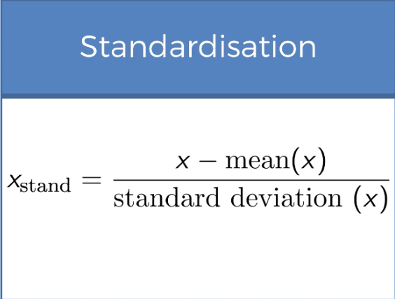
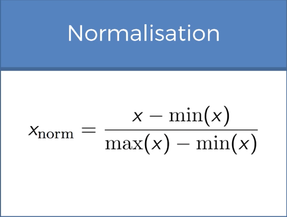
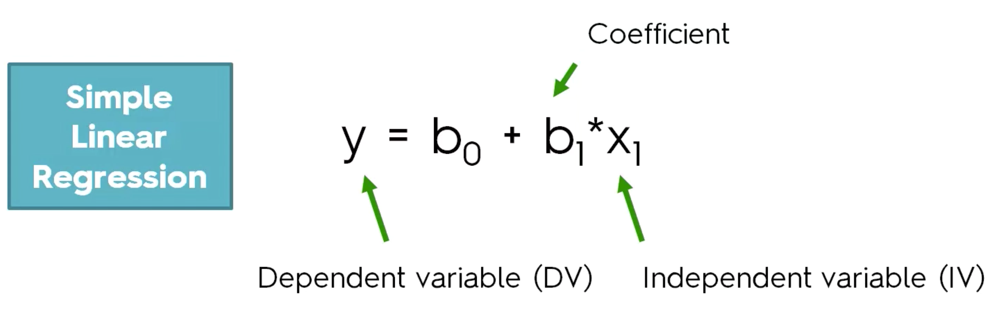
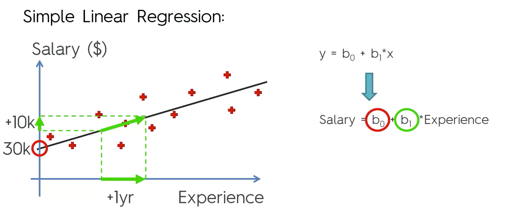
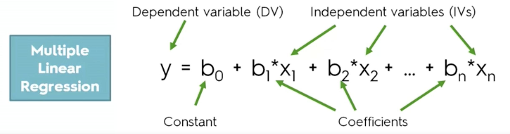

# Notes

## Over-fitting
Overfitting refers to a model that models the training data too well.

## Feature Scaling
Standardize the range of independent variables. It is splitted into standardization and normalization.

## Standardization

## Normalization

# Linear Regression Models

## Assumptions of Linear Regression:
### 1. Linearity
### 2. Homosecdticity
### 3. Multivariate normality
### 4. Independence of error

### 5. Lack of multicollinearity
1. Multicollinear(Dummy Variable Trap) - a scenario in which two or more variables are highly correlated; in simple terms one variable can be predicted from the others.
2. Solution to Dummy Variable Trap: 
Omit one of the categorical value, deprive it by doing `1 - D1`

## What is p-value? 
1. It is the chance of the result of a sample population represents the result of the entire population as a whole. In other words, it is used to prove weather a hypothesis is true or false.
2. A typical p-value used to prove this is `0.05`
3. A high p-values means the edvidence is strong and that a hypothesis is likely to be true to the entire population.
4. A low p-value means the edvidence is weak and that a hypothesis is likely to be false to the entire population.

## What is a Null Hypothesis?
1. The hypothesis that there is no relationship between the experimental variable(s) and the observed results.

## Simple Linear Regression

1. The Bias is basically where the line starts on the y-axis.

2. We plot a linear regression line with the training set of features and labels. When we apply the model to predict a value, the predicted value is calculated by the given feature in relation to that linear regression line. Basically with a given feature(X) we find where it lands on in the linear regression line which provides the label(Y). In other words, the linear regression line is a set of predicted values.

3. This model only works well when there is linear dependency. Which means the provided training set falls nicely along a linear regression line without outliers data points.

4. Positive Linear Relationship: The regression line slopes upward with the lower end of the line at the y intercept (axis) of the graph, and the upper end of line extending upward into the graph field, away from the x intercept (axis). In other words, the line goes upward

5. Negative Linear Relationship: The regression line slopes downward with the upper end of the line at the y intercept (axis) of the graph, and the lower end of line extending downward into the graph field, toward the x intercept (axis). In other words, the line goes downward 

6. No Relationship: There is no slope in the line, the line is flat.

## Multiple Linear Regression

## Building a Model
### 5 Methods of building models:
### 1. All-in
### 2. Backward Elimination
1. Select a significance level to stay in the model. (Typically al = 0.05, same as p-value norm)
2. Fit the Model with all possible predictors
3. Consider the predictor with the highest p-value. If `p > sl` go to step 4. Otherwise, go to step 7.
4. Remove the predictor
5. Update model without the removed predictor.
6. Go to step 3 again
7. Model is ready
### 3. Forward Selection
### 4. Bidirectional Elimination
### 5. Score Comparison